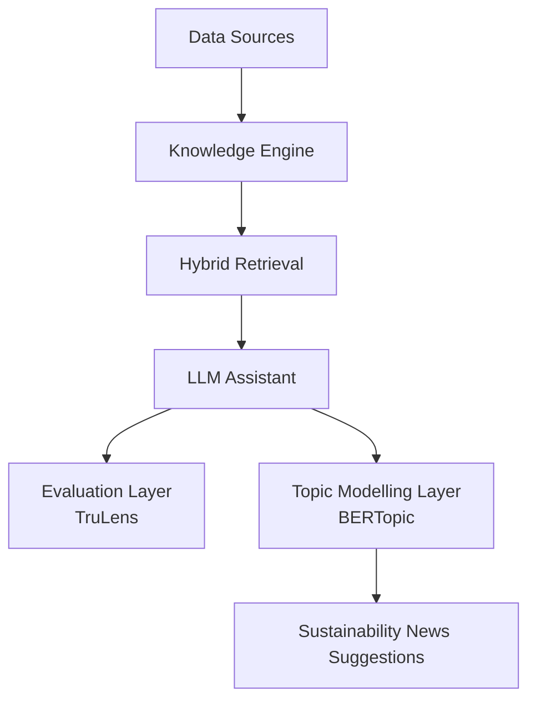
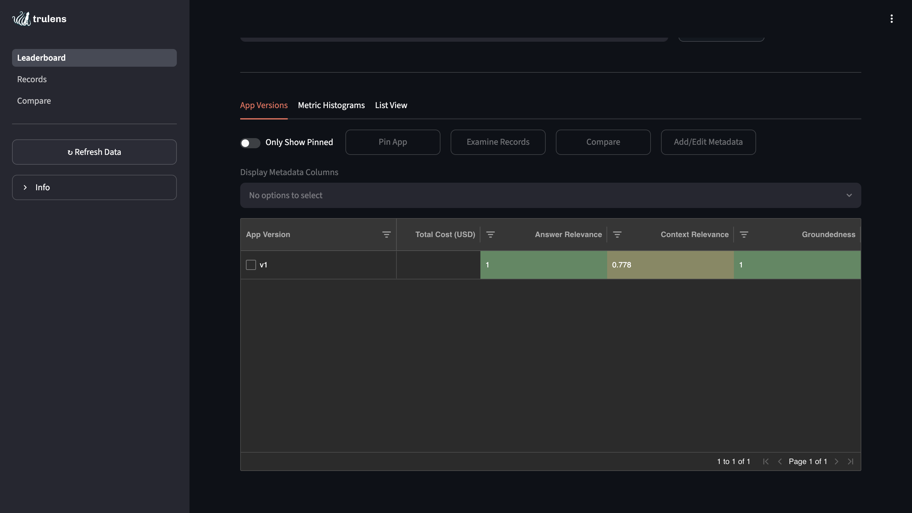
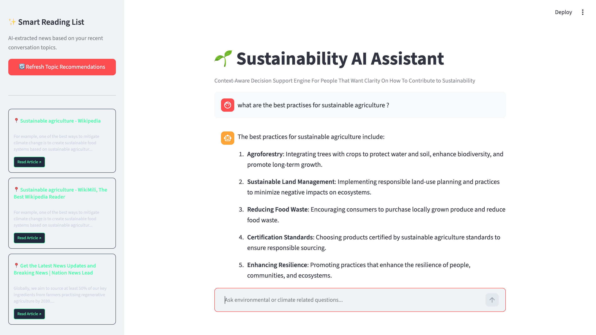
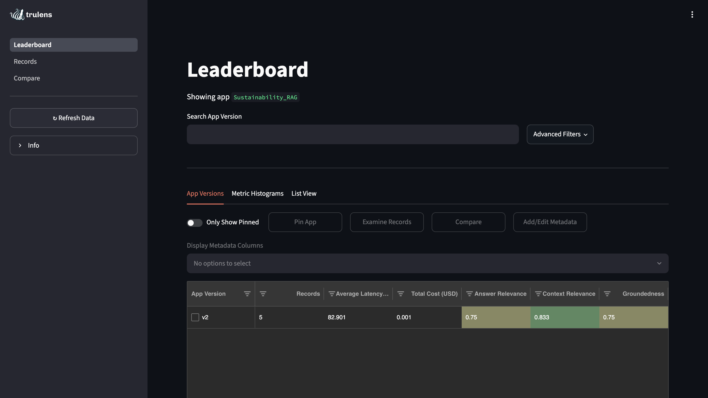

# Sustainable Intelligence Assistant

*A RAG-based AI Agent informing and supporting sustainability-related actions.*

---

# 1. Why This Project?

We all know about the current state of things on the planet: species going extinct, heat increasing dangerously, and water and food resources being put in jeopardy. This is a time for humans to act to preserve our environment.

However, sustainability information can be difficult to access and overwhelming to navigate. This project is for people like me, who want to contribute to a more sustainable way of living but do not necessarily know where to start.

This project is a trustworthy AI sustainability assistant that helps users make more meaningful environmental decisions using grounded and reliable AI-generated guidance.

---

# 2. Positive Impact

## Users

With this agent, sustainability is no longer a myth.

It makes it easier to understand complex ecology and sustainability-related information without the risk of receiving hallucinated information often associated with traditional AI chatbots.

The assistant simplifies sustainable decision-making and encourages meaningful action.

## Companies

Many companies are integrating RAG systems into their products.

For sustainability-driven companies, this creates an opportunity to educate users, help them better understand sustainability challenges, and encourage meaningful participation through campaigns, challenges, and sustainability initiatives.

## Society

This project promotes sustainable actions and knowledge, helping users move toward more informed environmental decisions.

---

# 3. System Overview

The system works as follows:  

---

# 4. Technical Architecture & Methodology

The project has been divided into six modules.

---

## Module A — Sustainability Knowledge Engine

### Purpose

This module creates a structured sustainability knowledge base from environmental and sustainability-related sources.

### Implementation

* Collected sustainability-related articles covering topics such as water, agriculture, plastic use, and environmental protection.
* Used LangChain WebLoader to retrieve and process article content.
* Split documents into chunks.
* Generated embeddings using HuggingFaceEmbeddings.
* Built a FAISS vector database from the generated embeddings.

### Why LangChain?

I chose LangChain because it simplifies the overall architecture through native support for embeddings, vector stores, retrievers, and chain orchestration.

For a proof-of-concept project, it allowed rapid experimentation. In a production environment, this component would likely require additional optimization and fine-tuning.

### Methods & Skills

* Data collection
* Document processing
* Chunking strategies
* Embedding generation
* Vector database construction

### Challenges

One of the main challenges was building the initial dataset and deciding how to collect relevant sustainability information.

Another area for further investigation is chunk sizing. A chunk size of 500 was selected as a starting point, but further experimentation could improve retrieval quality.

### Result

This module produces the chunks and vector store required for retrieval.

---

## Module B — Intelligent Retrieval Engine

### Purpose

Retrieve the most relevant sustainability knowledge from heterogeneous web sources while balancing semantic understanding, keyword matching, and ranking quality.

### Implementation

The retrieval pipeline combines different retrieval techniques:

* Parent–Child Retrieval: The knowledge base is in fact web articles with varying lengths and structures. Choosing an appropriate chunking strategy became an important design decision because it directly affected embedding quality and retrieval performance. We therefor decided that we would split them into large parent chunks (≈1500 characters) and smaller child chunks (≈250 characters). Child chunks are embedded for precise semantic search, while their corresponding parent chunks are returned to provide richer context to the language model.  
* Semantic Retrieval (FAISS + BGE embeddings): to capture conceptual similarity beyond exact keyword matching.  
* BM25 Retrieval: it complements semantic search by improving retrieval of documents containing important domain-specific terminology.  
* Weighted Ensemble Retrieval: it combines lexical and semantic retrieval using different weight configurations evaluated experimentally.  
* Cross-Encoder Reranking: it reorders retrieved documents using the BAAI/bge-reranker-v2-m3 model before selecting the final context provided to the LLM.  

### Retrieval Evaluation

Different ensemble weight combinations were evaluated using a manually constructed evaluation set consisting of representative sustainability questions and expected source documents. Evaluation metrics included:

* Hit Rate
* Mean Reciprocal Rank (MRR)

The final configuration prioritized Hit Rate to maximize the probability of retrieving relevant evidence, while the Cross-Encoder reranker optimized the final ordering of retrieved documents.

### Methods & Skills

* Embeddings
* Hybrid Information Retrieval
* Parent–Child Retrieval
* Information Retrieval Experimentation
* Embedding-based Search
* Retrieval Evaluation
* Ranking & Reranking
* FAISS Vector Search
* BM25

### Challenges

One of the main design challenges was selecting an effective chunking strategy for heterogeneous web content. Because the knowledge base consisted of long web articles with varying structures rather than standardized datasets, chunk size directly influenced embedding quality, retrieval precision, and the amount of context supplied to the language model. A Parent–Child retrieval strategy was adopted to balance fine-grained semantic retrieval with sufficiently rich contextual information for answer generation.  

A second challenge was tuning the hybrid retrieval system. Rather than relying on default ensemble weights, multiple BM25/semantic retrieval combinations were evaluated using retrieval metrics before applying Cross-Encoder reranking to improve document ordering.

### Result

This module resulted in a hybrid retrieval engine capable of combining semantic and keyword search while improving ranking quality through reranking.

### Possible Improvement

Accelerate the weight optimization process, which could become computationally expensive on larger datasets.

---

## Module C — Trust & Hallucination Evaluation Layer

### Purpose

Ensure the system produces grounded and relevant answers.

### Implementation

* Integrated TruLens
* Built evaluation functions for:

  * Groundedness
  * Context Relevance
  * Answer Relevance
* Configured evaluation recording and dashboard monitoring

Unlike a traditional LLM chatbot, this layer provides visibility into answer quality and retrieval performance.

### Methods & Skills

* RAG Evaluation
* Retrieval Quality Assessment
* LLM Evaluation
* TruLens
* Observability

### Challenges

The largest challenge was integrating TruLens into an architecture initially not designed around class structures.

Significant refactoring was required before evaluation components could properly observe retrieval and generation steps.

### Improvement

A self-evaluation layer could be added to automatically verify responses before presenting them to users.

---

## Module D — Sustainability Guidance Assistant

### Purpose

This module transforms retrieved information into actionable sustainability guidance.

The language model is prompted not only to answer questions but also to help users identify practical and meaningful sustainability actions.

This is the layer responsible for converting information into decision support.

---

## Module E — AI Observability & Monitoring

### Purpose

Monitor system performance and operational metrics.

### Implementation

Using the TruLens dashboard, the system tracks:

* Groundedness
* Context Relevance
* Answer Relevance
* Latency
* Trace-level performance metrics

### Observations

Current average latency is approximately 53–55 seconds, indicating opportunities for optimization.

---

## Module F — Topic Modelling & Personalization

### Purpose

Identify the sustainability topics users are most interested in and recommend additional learning resources.

### Implementation

* User questions are tracked
* BERTopic identifies underlying themes
* Top keywords are extracted
* Search queries are generated
* DDGS retrieves relevant articles

### Methods & Skills

* NLP
* Topic Modelling
* BERTopic
* Recommendation Systems
* Information Retrieval
* DDGS

### Result

The system recommends three articles related to topics the user recently explored.

### Next Step

Create dynamic recommendations that evolve continuously with user interests.

### Challenges

The biggest challenge was handling very small datasets of user questions.

Different strategies were implemented depending on the amount of available user input:

* Single question → keyword extraction
* Fewer than 15 questions → UMAP parameter adjustment

---

## Overall Engineering Challenge: From Individual Components to a Cohesive System

One of the biggest challenges throughout this project was not building the individual modules themselves, but designing them so they could operate as a coherent and maintainable system.

While the project was intentionally divided into separate modules for readability, experimentation, and maintainability, most of these modules are highly interdependent. The vector database generation process, for example, directly affects retrieval quality, retrieval affects answer generation, answer generation affects evaluation, and user interactions influence the recommendation and topic modeling layers.

As a result, **the challenge was not simply separating components, but designing clear interfaces between them while preserving flexibility and modularity.**

For example:

The Knowledge Engine generates chunks, embeddings, and vector stores that are later consumed by the retrieval layer.
The Retrieval Engine feeds context into the generation layer.
The Evaluation Layer requires visibility into retrieval and generation outputs simultaneously.
The Topic Modeling Layer relies on user interactions generated by the conversational agent.

This became particularly challenging when integrating TruLens. The evaluation framework requires access to specific stages of the RAG pipeline, which meant the initial implementation had to be restructured into clearer responsibilities.

To solve this, the application was progressively refactored into modular components with explicit responsibilities:

- Knowledge Base Construction
- Retrieval
- Generation
- Evaluation
- Recommendation
- Monitoring

One of the main lessons from this project was understanding how to architect a system where components can evolve independently while continuing to work together.
While the architecture is functional, rebuilding a similar system from scratch would further strengthen my understanding of the interactions between retrieval systems, evaluation frameworks, observability layers, and conversational AI applications.

---

# Evaluation

Current metrics:

| Metric            | Value |
| ----------------- | ----- |
| Groundedness      | 6.75  |
| Context Relevance | 0.83  |
| Answer Relevance  | 0.75  |
| Average Latency   | ~82s  |

These results indicate that answer relevance is strong, while groundedness and retrieval quality still have room for improvement through dataset expansion and retrieval optimization.

---

# Demo

---

# What I Learned

* Integrating TruLens into a conversational RAG architecture.
* Structuring retrieval and generation pipelines for observability.
* Understanding Hit Rate and Mean Reciprocal Rank (MRR).
* Evaluating trade-offs between retrieval coverage and ranking quality.
* Using rerankers to compensate for retrieval ordering limitations.
* Implementing topic modelling under extremely low-data conditions.
* Building memory-enabled conversational RAG systems using LangChain.

---

# Future Improvements

* Add conference and event recommendations based on user interests.
* Expand and improve the sustainability knowledge base.
* Continue optimizing retrieval weighting strategies.
* Deploy the system for real-world usage.
* Add a self-evaluation and confidence-scoring layer.
* Improve personalization and recommendation capabilities.

---

# Technologies

* Python
* LangChain
* HuggingFace Embeddings
* FAISS
* BM25 Retriever
* CrossEncoder Reranker
* OpenAI
* Streamlit
* TruLens
* BERTopic
* NLP
* Scikit-Learn
* UMAP
* DDGS
